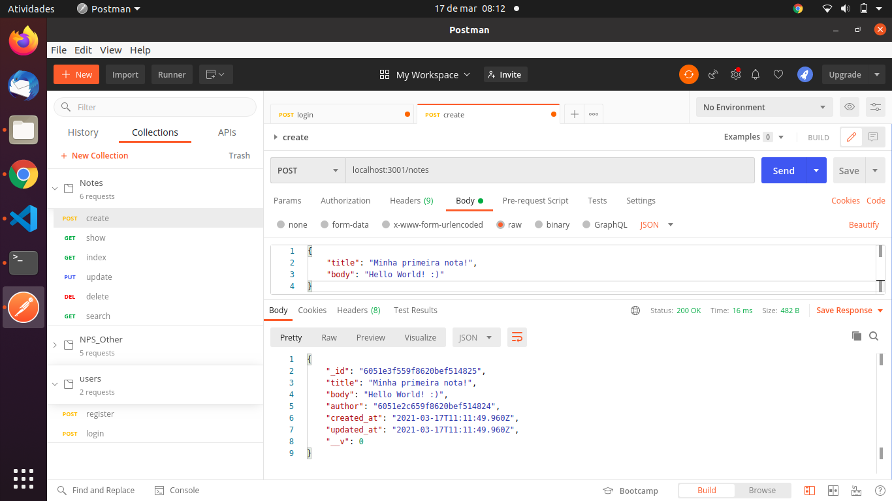
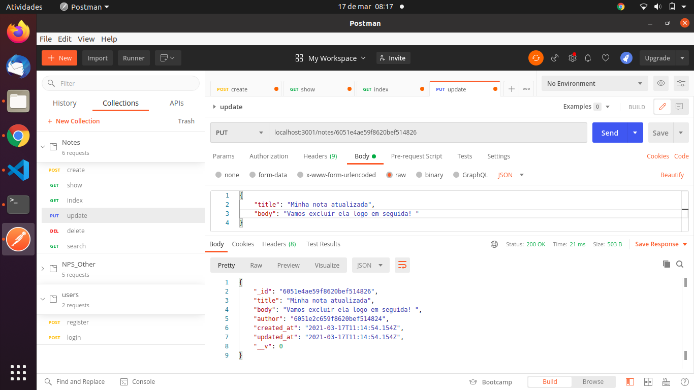
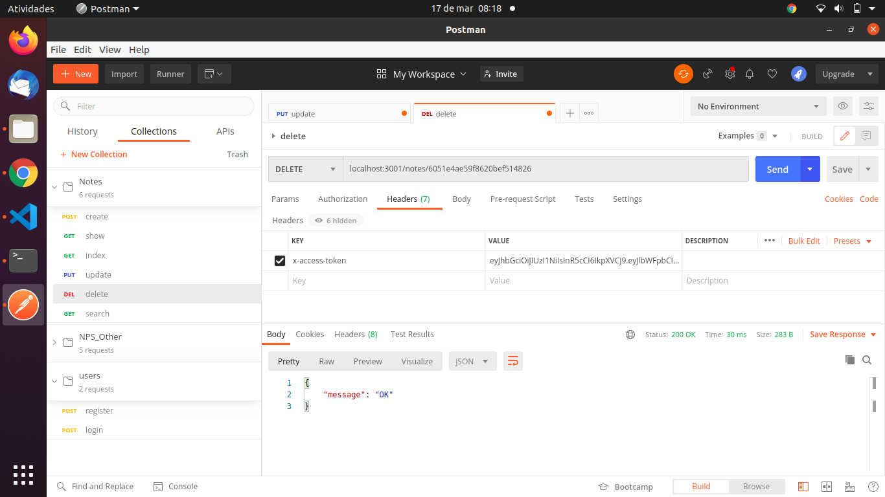
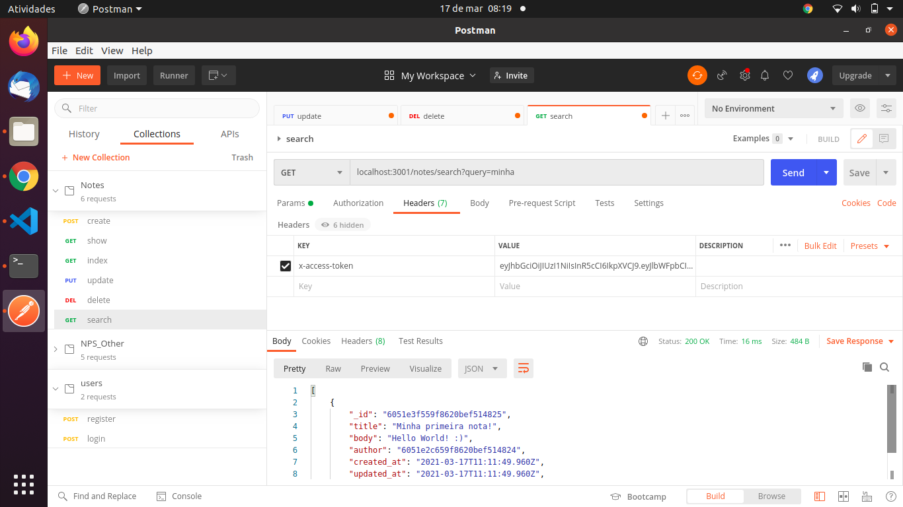
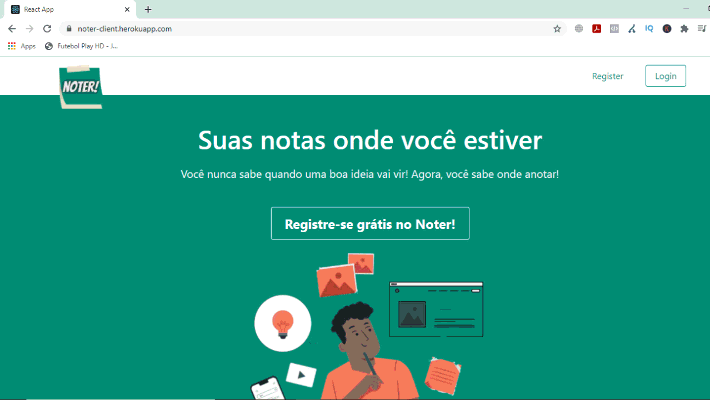
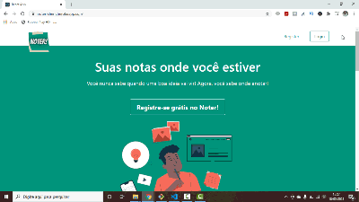

  

  <h1> Noter! </h1>

<h3 align = "center">
  Suas Notas em qualquer lugar, a qualquer hora! 🗒️
</h3>

<h4 align = "center">
	✅ Noter! 🚀 Versão 1.0 ✅
</h4>

 

 <a href="#visao">Visão geral</a> •
 <a href="#features">Features</a> •
 <a href="#demonstracao">Demonstração</a> • 
 <a href="#requisitos">Pré-requisitos</a> • 
 <a href="#tecnologias">Tecnologias</a> • 
 <a href="#autor">Autor</a> •
 <a href="#licenca">Licença</a>

 
 
 
 

<h2> 🔎 Visão geral </h2>
Noter é um sistema web de criação e gestão de notas e textos. Utilizando o que há de melhor no back-end com Node Js e Express, e no front-end com React JS, o Noter permite que você manipule do seu jeito os textos e assuntos que quiser armazenar online, a qualquer hora e em qualquer lugar! 

 
 
 

<h2> ⚙️ Features </h2>

✅ Cadastro de usuário 
✅ Cadastro de notas 
✅ Gestão de usuário (edição, exclusão) 
✅ Gestão de notas (edição, exclusão)
 
 
 

<h2> 📌 Demonstração da API</h2>

Veremos melhor agora como a aplicação funciona. Utilizando uma ferramenta de testes de serviços RESTful, o Postman, irei apresentar como nossa API está funcionando no back-end. 
 
 

<h3>Registrando o Usuário</h3>
Nesse momento, passamos no formato JSON o nome, e-mail e senha de nosso usuário fictício "Luis User" para que fosse registrado em nosso banco de dados não-relacional, o Mongo. O retorno, como você pode ver no screenshot abaixo, são as informações passadas acima e algumas complementadas pelo próprio back-end da aplicação, como id e a data da criação e atualização do usuário.
  
Note que a senha retorna em hash para maior segurança do usuário, utilizando a lib Bcrypt do Node para fazer isso.  
  

  

 
 

<h3>Registrando uma nota</h3>
O próximo teste que faremos é a criação de uma nota por parte desse novo usuário que criamos. Para que funcione, teremos que passar o título e o corpo da nota que desejamos criar, junto com o token de acesso do usuário logado no header de nossa aplicação para que não apresente um erro de autenticação que impeça a criação da nota. 
  
Cada nota recebe, além das configurações criadas, uma id que pertence apenas àquela nota, o id do autor, e assim como no usuário, uma data de criação e atualização de dados da nota.  
  

  

 
 

<h3>Gestão de notas</h3>
O APP nos permite manipular nossas notas e dados de várias maneiras, de acordo com cada uma das rotas criadas e previamente estabelecidas. Caso desejemos realizar algum tipo de alteração nas notas, ou excluí-las, exibí-las, pesquisá-las, dentre muitas outras, podemos fazer isso passando os parâmetros corretos em formato JSON ou na URL, como pode ser visto nos prints abaixo!
  

  

 

  

 

  

 
 
 

<h2> 📌 Demonstração do APP</h2>
Agora chegou a hora de vermos o nosso cliente React em ação! Desenvolvido todo em React JS, utilizando a RBX, uma implementação do React que nos permite utilizar os componentes do Bulma, o sistema ficou com o layout responsivo abaixo!
  

  

  
Vamos testar as funcionalidades dele? Veja no gif abaixo o registro e edição de notas e usuários no decorrer da aplicação!
 

  

  
Caso deseje ver e utilizar o APP, basta clicar no link abaixo e conferir no Heroku!
  
<a href="https://noter-client.herokuapp.com/"> Veja o Noter Online! </a>
 
 
 

<h2> 🎲 Pré-requisitos </h2>
Antes de começar, você vai precisar ter instalado em sua máquina as seguintes ferramentas: Git, Node.js, Express, Mongo Db, Postman (ou outra ferramenta de testes de rotas) e React. Além disto é bom ter um editor para trabalhar bem o código. Recomendamos o VS Code.
  
<strong> Clone este repositório </strong> 
$ git clone https://github.com/tluis9/noter.git
  
<strong> Acesse a pasta do projeto no terminal/cmd</strong> 
$ cd Noter
  
<strong> Instale as dependências (veremos todas no tópico seguinte) </strong> 
 
<strong> Execute a API e o client React </strong> 
$ npx nodemon start 
$ npm start
  
Recomendamos a API iniciar na porta:3001 - acesse http://localhost:3001 
Recomendamos o cliente iniciar na porta:3000 - acesse http://localhost:3000

 
 
 

<h2>🛠 Tecnologias</h2>
As seguintes ferramentas foram usadas na construção do projeto:
 

- 
- [NPM] => (https://www.npmjs.com/)
    [Nodemon] => (https://www.npmjs.com/package/nodemon)
    [Bcrypt] => (https://www.npmjs.com/package/bcrypt)
    [JWT] => (https://www.npmjs.com/package/jsonwebtoken)
    [Dotenv] => (https://www.npmjs.com/package/dotenv)
    [Cors] => (https://www.npmjs.com/package/cors)
    [RBX] => (https://www.npmjs.com/package/rbx)
    [React-router-dom] => (https://www.npmjs.com/package/react-router-dom)
    [React-quill] => (https://www.npmjs.com/package/react-quill)
    [Axios] => (https://www.npmjs.com/package/axios)
    [Node-Sass] => (https://www.npmjs.com/package/node-sass)
    [Bulma] => (https://www.npmjs.com/package/bulma)
    [React-burger-menu] => (https://www.npmjs.com/package/react-burger-menu)
    
- [Express] => (https://expressjs.com/en)
- [MongoDB] => (https://www.mongodb.com/)
- [Mongoose] => (https://mongoosejs.com/)
- [React] => (https://pt-br.reactjs.org/)
- [Moment] => (https://momentjs.com/)
- [Fontawesome] => (https://fontawesome.com/)

<ul>
  <li>[Node.js] => (https://nodejs.org/en/)</li>
  <li>[NPM] => (https://www.npmjs.com/)
    <ul>
      <li>[Nodemon] => (https://www.npmjs.com/package/nodemon)</li>
      <li>[Bcrypt] => (https://www.npmjs.com/package/bcrypt)</li>
      <li>  [JWT] => (https://www.npmjs.com/package/jsonwebtoken)</li>
      <li>  [Dotenv] => (https://www.npmjs.com/package/dotenv)</li>
      <li>  [Cors] => (https://www.npmjs.com/package/cors)</li>
      <li>  [RBX] => (https://www.npmjs.com/package/rbx)</li>
      <li>  [React-router-dom] => (https://www.npmjs.com/package/react-router-dom)</li>
      <li>  [React-quill] => (https://www.npmjs.com/package/react-quill)</li>
      <li>  [Axios] => (https://www.npmjs.com/package/axios)</li>
      <li>  [Node-Sass] => (https://www.npmjs.com/package/node-sass)</li>
      <li>  [Bulma] => (https://www.npmjs.com/package/bulma)</li>
      <li>  [React-burger-menu] => (https://www.npmjs.com/package/react-burger-menu)</li>
    </ul>
  </li>  
   <li>  [Express] => (https://expressjs.com/en)</li>
   <li>[MongoDB] => (https://www.mongodb.com/)</li>
 <li>[Mongoose] => (https://mongoosejs.com/)</li>
 <li>[React] => (https://pt-br.reactjs.org/)</li>
 <li>[Moment] => (https://momentjs.com/)</li>
 <li>[Fontawesome] => (https://fontawesome.com/)    </li>      
</ul>

 
 
 

<h2> 🧑🏽 Autor </h2>

<a href="https://www.linkedin.com/in/t%C3%A9rcio-lu%C3%ADs-martins-ab3992207">
 
  
 <b>Tércio Luís</b></a> <a href="https://www.linkedin.com/in/t%C3%A9rcio-lu%C3%ADs-martins-ab3992207" title="luis">🚀</a>

Feito com ❤️ por Tércio Luís 👋🏽 Entre em contato!
 

<strong><a href="https://www.linkedin.com/in/t%C3%A9rcio-lu%C3%ADs-martins-ab3992207" style="text-decoration: normal;"> 💼 LinkedIn </a></strong> • <strong><a href="https://www.instagram.com/tercioluis_/" style="text-decoration: normal;"> 📱 Instagram </a></strong> • <strong> 📨 terciolmn98@gmail.com</strong> 

 
 
 

<h2> ✍🏼 Licença </h2>
MIT Copyright 2021 Tércio Luís

 
 
 